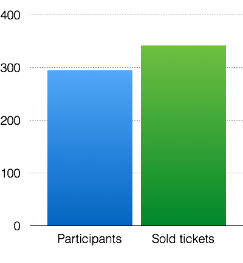

The goal of the JS Unconf Team is to create an environment where
everybody can learn about JavaScript and Software Development.
We are doing this event for the community and not for any profit.

But let's see the numbers!

### Who financed the event

  

### This is how we spent our money in 2014

### JS Unconf is a non-profit conference made for the community

### We have a lot of participants

This post is inspired by the LXJS 2012 Transparency Report,
The JS Conf EU "This is how we are spending
your money" report and the "EmpireJS by the Numbers" blog post by
Charlie Robbins.

